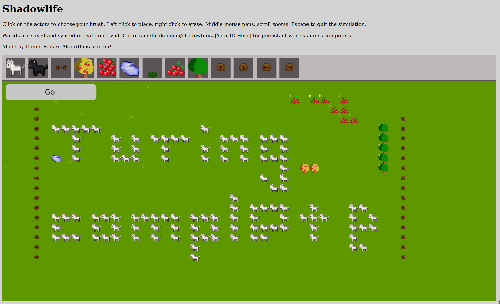

# ShadowLife
ShadowLife is a Haxe port of my Java SWEN20003 (object oriented software development) project. 'ShadowLife', as named and designed by Eleanor McMurty, is a small turing complete simulation system in which various entities follow movement and duplication rules.

As an extension to the Java implementation the assignment required, I reimplemented the project with Haxe, Kha, and Node JS. It features

 - An accurate implementation of the provided specification.
 - A level editor (personal extension)
 - A server that allows realtime collaborative editing of worlds, through shared URLs (personal extension)
 
 Being an (unmarked) extension of a marked assignment during the busy University term, it didn't get all the polish it could have had (server persistence, secure websockets, fullscreen mode, nicer client side design, complete code cleanup, etc). I've moved on from this project and it is unlikely to receive these improvements.
 
 
